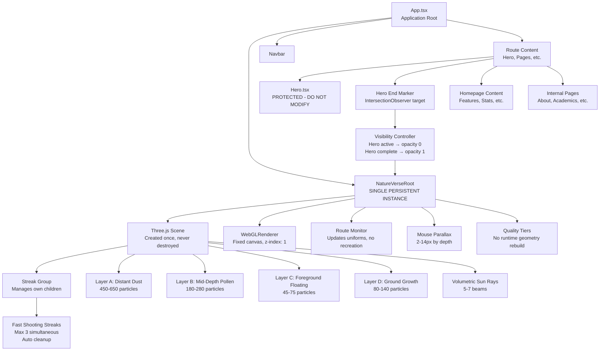
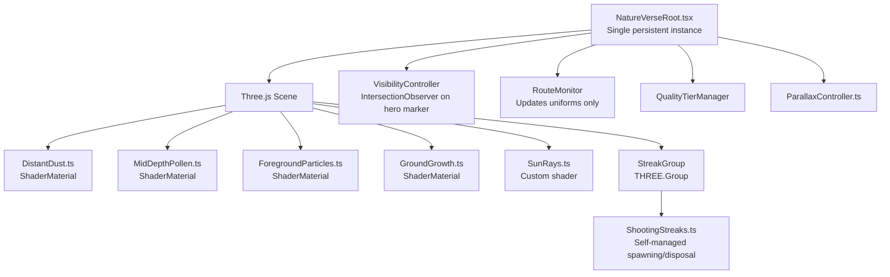
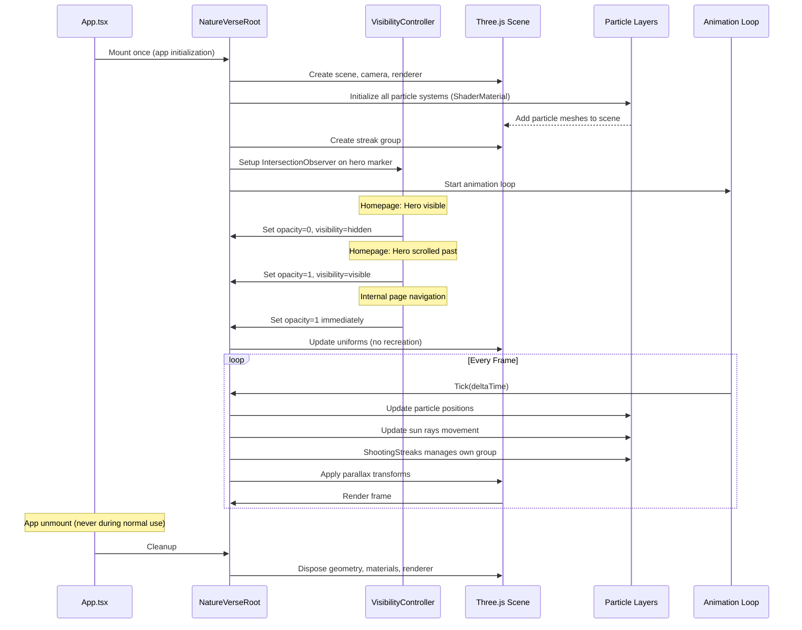
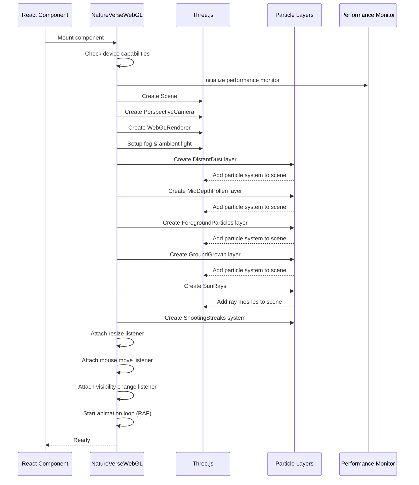
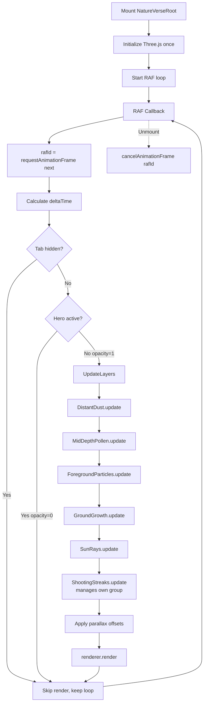

# Design Document: NatureVerse Three.js Transformation

## Overview

Transform the HLS Inter College website from CSS-based particle animations into a premium cinematic 3D WebGL environment using Three.js. The system will render real-time 3D particle systems with multiple depth layers (distant dust, mid-depth pollen, foreground floating, ground-rising), volumetric sunlight rays, fast shooting golden streaks, pointer-based parallax, and atmospheric fog. The architecture ensures a single persistent Three.js scene that respects the protected Hero component, maintains canvas positioning behind all content, and provides seamless integration across homepage and internal pages through NatureVersePageWrapper. The goal is to create a visually rich, performant natural atmosphere comparable to premium space-themed agency websites but using forest/nature themes.

## Architecture

### CRITICAL: Hero Protection and Visibility Control

**The fixed canvas WILL appear over the hero if not explicitly controlled.**

```typescript
// App.tsx structure
<div className="app-root">
  <NatureVerseRoot 
    route={route}
    isHeroActive={isHeroActive}
  />
  <Header />
  {route === 'home' && (
    <>
      <Hero />
      <div 
        ref={heroEndMarkerRef} 
        className="hero-end-marker"
        style={{ position: 'absolute', height: '1px' }}
      />
    </>
  )}
  <RouteContent />
  <Footer />
</div>
```

**Visibility Control Logic**:
```typescript
// In App.tsx or visibility hook
const [isHeroActive, setIsHeroActive] = useState(route === 'home');

useEffect(() => {
  if (route !== 'home') {
    setIsHeroActive(false);
    return;
  }
  
  const marker = heroEndMarkerRef.current;
  if (!marker) return;
  
  const observer = new IntersectionObserver(
    ([entry]) => {
      // When marker becomes visible, hero has scrolled past
      setIsHeroActive(!entry.isIntersecting);
    },
    { threshold: 0 }
  );
  
  observer.observe(marker);
  return () => observer.disconnect();
}, [route]);
```

**Canvas Visibility Styling**:
```css
/* In NatureVerseRoot */
.natureverse-canvas {
  position: fixed;
  inset: 0;
  z-index: 1;
  pointer-events: none;
  transition: opacity 0.6s ease, visibility 0.6s ease;
}

.natureverse-canvas--hidden {
  opacity: 0;
  visibility: hidden;
}

.natureverse-canvas--visible {
  opacity: 1;
  visibility: visible;
}
```

### High-Level System Architecture



### Component Hierarchy



### Rendering Pipeline



## Components and Interfaces

### Component 1: NatureVerseRoot

**Purpose**: Single persistent WebGL engine mounted once at application root level

**Interface**:
```typescript
interface NatureVerseRootProps {
  route: string;
  isHeroActive: boolean; // Controlled by visibility detection
}

export default function NatureVerseRoot({ route, isHeroActive }: NatureVerseRootProps): JSX.Element;
```

**Responsibilities**:
- Mount once in App.tsx (never unmount during normal use)
- Create Three.js scene, camera, renderer on initial mount
- Apply visibility control: `opacity: ${isHeroActive ? 0 : 1}; visibility: ${isHeroActive ? 'hidden' : 'visible'}`
- Update uniforms when route changes (DO NOT recreate renderer)
- Use fixed canvas positioning: `position: fixed; inset: 0; z-index: 1; pointer-events: none`
- Run single animation loop with proper RAF cleanup
- Manage IntersectionObserver or scroll detection for hero boundary


### Component 2: Particle Layer Base (ShaderMaterial-based)

**Purpose**: Reusable shader-based particle system with custom per-particle attributes

**Interface**:
```typescript
interface ParticleLayerConfig {
  count: number;
  sizeRange: [number, number];
  opacityRange: [number, number];
  depthRange: [number, number];
  speedRange: [number, number];
  colors: string[];
  isMobile: boolean;
}

// Shared shader material for all particle layers
const particleShader = {
  vertexShader: `
    attribute float aSize;
    attribute float aOpacity;
    attribute float aPhase;
    varying float vOpacity;
    varying vec3 vColor;
    
    void main() {
      vOpacity = aOpacity;
      vColor = color;
      vec4 mvPosition = modelViewMatrix * vec4(position, 1.0);
      
      // Depth-based size scaling
      float scale = 300.0;
      gl_PointSize = aSize * (scale / -mvPosition.z);
      
      gl_Position = projectionMatrix * mvPosition;
    }
  `,
  fragmentShader: `
    varying float vOpacity;
    varying vec3 vColor;
    
    void main() {
      // Create soft circular particle
      vec2 center = gl_PointCoord - vec0.5;
      float dist = length(center);
      if (dist > 0.5) discard;
      
      float alpha = vOpacity * (1.0 - smoothstep(0.3, 0.5, dist));
      gl_FragColor = vec4(vColor, alpha);
    }
  `
};

export class ParticleLayerBase {
  protected particles: THREE.Points;
  protected geometry: THREE.BufferGeometry;
  protected material: THREE.ShaderMaterial;
  protected velocities: Float32Array;
  protected phases: Float32Array;
  
  constructor(config: ParticleLayerConfig);
  update(deltaTime: number): void;
  getMesh(): THREE.Points;
  dispose(): void;
}
```

**Responsibilities**:
- Use ShaderMaterial, NOT PointsMaterial
- Read custom attributes: aSize, aOpacity, aPhase
- Calculate depth-based point sizing in vertex shader
- Create soft circular particles in fragment shader
- Store velocity and phase data for animation
- Provide base class for all particle layers

### Component 3: DistantDust (Particle Layer Module)

**Purpose**: Creates and animates Layer A - distant atmospheric dust particles using ShaderMaterial

**Interface**:
```typescript
export class DistantDust extends ParticleLayerBase {
  constructor(config: ParticleLayerConfig);
  update(deltaTime: number): void;
  getMesh(): THREE.Points;
  dispose(): void;
}
```

**Responsibilities**:
- Extend ParticleLayerBase with ShaderMaterial
- Generate 450-650 particles (desktop) with very small size (1-3px)
- Set low opacity (0.15-0.32) via aOpacity attribute
- Apply slow falling motion (2-5 units/sec)
- Update positions per frame with velocity
- Respawn particles when they exit bounds

### Component 4: MidDepthPollen

**Purpose**: Creates Layer B - mid-depth pollen particles with warm colors

**Interface**:
```typescript
export class MidDepthPollen {
  private particles: THREE.Points;
  private geometry: THREE.BufferGeometry;
  private material: THREE.PointsMaterial;

  private velocities: Float32Array;
  private phases: Float32Array;
  
  constructor(config: ParticleLayerConfig);
  update(deltaTime: number): void;
  getMesh(): THREE.Points;
  dispose(): void;
}
```

**Responsibilities**:
- Generate 180-280 particles with medium size
- Warm colors (golden, amber tones)
- Depth-based size and opacity (0.30-0.62)
- Varied movement patterns (drift + fall)
- Phase offsets for organic motion

### Component 5: ForegroundParticles

**Purpose**: Creates Layer C - large foreground floating particles with golden bloom

**Interface**:
```typescript
export class ForegroundParticles {
  private particles: THREE.Points;
  private geometry: THREE.BufferGeometry;
  private material: THREE.PointsMaterial | THREE.ShaderMaterial;
  private velocities: Float32Array;
  private curvePaths: Float32Array;
  
  constructor(config: ParticleLayerConfig);
  update(deltaTime: number): void;
  getMesh(): THREE.Points;
  dispose(): void;
}
```

**Responsibilities**:
- Generate 45-75 larger particles close to camera

- Soft blur effect
- Curved motion paths (Bezier-like)
- Golden bloom glow (opacity 0.22-0.48)
- Slow elegant movement

### Component 6: GroundGrowth

**Purpose**: Creates Layer D - particles rising from bottom green ground with fade

**Interface**:
```typescript
export class GroundGrowth {
  private particles: THREE.Points;
  private geometry: THREE.BufferGeometry;
  private material: THREE.PointsMaterial;
  private velocities: Float32Array;
  private lifetimes: Float32Array;
  
  constructor(config: ParticleLayerConfig);
  update(deltaTime: number): void;
  getMesh(): THREE.Points;
  dispose(): void;
}
```

**Responsibilities**:
- Generate 80-140 particles from bottom 20-30%
- Moss green and gold colors
- Rising motion upward
- Fade opacity before reaching upper half (0.35-0.72)
- Reset particles when they fade out

### Component 7: SunRays

**Purpose**: Creates volumetric sunlight beams entering diagonally


**Interface**:
```typescript
interface SunRayConfig {
  count: number;
  widthRange: [number, number];
  opacityRange: [number, number];
  angleRange: [number, number];
  speedRange: [number, number];
}

export class SunRays {
  private rays: THREE.Mesh[];
  private geometry: THREE.PlaneGeometry;
  private material: THREE.ShaderMaterial;
  private phases: Float32Array;
  
  constructor(config: SunRayConfig);
  update(deltaTime: number): void;
  getMeshes(): THREE.Mesh[];
  dispose(): void;
}
```

**Responsibilities**:
- Create 5-7 translucent beam meshes
- Soft edges using shader gradients
- Additive blending for light effect
- Slow movement (10-18s duration)
- Different widths, intensities, angles
- Opacity range 0.08-0.22

### Component 8: ShootingStreaks

**Purpose**: Spawns and manages fast-moving golden light streaks with self-contained lifecycle

**Interface**:
```typescript
interface StreakConfig {
  spawnInterval: [number, number]; // 2.5-6 seconds
  durationRange: [number, number]; // 0.45-0.9 seconds
  worldLength: number; // Length in world units (NOT pixels)
  coreOpacity: [number, number]; // 0.75-1
  tailOpacity: [number, number]; // 0-0.65
  maxSimultaneous: number; // 3
}

interface ActiveStreak {
  mesh: THREE.Mesh;
  velocity: THREE.Vector3;
  lifetime: number;
  maxLifetime: number;
}

export class ShootingStreaks {
  private group: THREE.Group; // Passed from NatureVerseRoot
  private activeStreaks: ActiveStreak[];
  private geometry: THREE.PlaneGeometry;
  private material: THREE.ShaderMaterial;
  private spawnTimer: number;
  private nextSpawnTime: number;
  
  constructor(group: THREE.Group, config: StreakConfig);
  update(deltaTime: number): void;
  private spawnStreak(): void;
  private removeExpiredStreaks(): void;
  dispose(): void;
}
```

**Responsibilities**:
- Receive THREE.Group from NatureVerseRoot (DO NOT call scene.add repeatedly)
- Spawn streaks from upper-left, upper-right, or side edges (NOT bottom)
- Travel diagonally inward (NOT upward from bottom)
- Use world units for dimensions (convert from screen if needed)
- Bright white-gold core with golden tail gradient
- Duration 0.45-0.9 seconds, appear every 2.5-6 seconds
- Maximum 3 simultaneous streaks
- Internally add new streaks to group
- Internally remove and dispose expired streaks
- Dispose geometry and materials on cleanup

### Component 9: ParallaxController

**Purpose**: Applies mouse-based parallax to scene elements based on depth

**Interface**:
```typescript
interface ParallaxConfig {
  enabled: boolean;
  sensitivity: number; // 0-1
  maxOffset: [number, number]; // [x, y] in pixels
}

export class ParallaxController {
  private mouseX: number;
  private mouseY: number;
  private targetX: number;
  private targetY: number;
  private config: ParallaxConfig;
  
  constructor(config: ParallaxConfig);
  updateMousePosition(x: number, y: number): void;
  getParallaxOffset(depth: number): { x: number; y: number };
  update(deltaTime: number): void;
  dispose(): void;
}
```

**Responsibilities**:
- Track mouse/pointer position
- Calculate parallax offset based on depth (2-14px range)
- Smooth interpolation between positions
- Apply different offsets to different depth layers
- Disable on reduced motion


### Component 10: QualityTierManager

**Purpose**: Manages device-specific quality tiers without runtime geometry mutation

**Interface**:
```typescript
interface QualityTier {
  name: 'high' | 'medium' | 'low' | 'minimal';
  particleCounts: {
    distantDust: number;
    midDepthPollen: number;
    foreground: number;
    groundGrowth: number;
  };
  sunRayCount: number;
  streakInterval: [number, number];
  pixelRatio: number;
  parallaxEnabled: boolean;
}

export class QualityTierManager {
  private currentTier: QualityTier;
  private deviceTier: 'desktop' | 'mobile';
  
  constructor(deviceTier: 'desktop' | 'mobile');
  getCurrentTier(): QualityTier;
  degradeQuality(): void; // Reduce via setDrawRange, disable features
  restoreQuality(): void;
}
```

**Responsibilities**:
- Set initial quality tier based on device (desktop vs mobile)
- Provide particle counts for initialization (NOT runtime mutation)
- Degrade quality through:
  - geometry.setDrawRange() to reduce visible particles
  - Disable foreground particles
  - Reduce sun-ray count
  - Increase streak intervals
  - Disable parallax
  - Lower pixel ratio
- DO NOT rebuild geometry during runtime unless absolutely necessary
- Track degradation steps for potential restoration

## Data Models

### Model 1: ParticleSystemState

```typescript
interface ParticleSystemState {
  isActive: boolean;
  isPaused: boolean;
  totalParticles: number;
  visibleParticles: number;
  currentFPS: number;
  quality: 'high' | 'medium' | 'low';
  reducedMotion: boolean;
  isMobile: boolean;
}
```

**Validation Rules**:
- `totalParticles` must be >= 0
- `visibleParticles` must be <= `totalParticles`
- `currentFPS` must be >= 0 and <= 240
- `quality` must be one of the three valid levels

### Model 2: ParticleAttributes

```typescript
interface ParticleAttributes {
  positions: Float32Array; // x, y, z for each particle
  velocities: Float32Array; // vx, vy, vz for each particle
  sizes: Float32Array; // size for each particle
  opacities: Float32Array; // alpha value for each particle
  colors: Float32Array; // r, g, b for each particle

  lifetimes?: Float32Array; // current lifetime (for respawning)
  maxLifetimes?: Float32Array; // maximum lifetime before respawn
  phases?: Float32Array; // phase offset for sinusoidal motion
}
```

**Validation Rules**:
- All arrays must have consistent lengths (positions = 3 * count, velocities = 3 * count, etc.)
- `sizes` must contain positive values
- `opacities` must be in range [0, 1]
- `colors` must be in range [0, 1] for each RGB component
- If `lifetimes` exists, `maxLifetimes` must also exist

### Model 3: SceneConfiguration

```typescript
interface SceneConfiguration {
  mode: 'home' | 'internal';
  camera: {
    fov: number;
    near: number;
    far: number;
    position: { x: number; y: number; z: number };
  };
  renderer: {
    pixelRatio: number;
    antialias: boolean;
    alpha: boolean;
    powerPreference: 'high-performance' | 'low-power' | 'default';
  };
  fog: {
    enabled: boolean;
    color: string;
    near: number;
    far: number;
  };
  lighting: {

    ambientIntensity: number;
    ambientColor: string;
  };
  particleLayers: {
    distantDust: ParticleLayerConfig;
    midDepthPollen: ParticleLayerConfig;
    foreground: ParticleLayerConfig;
    groundGrowth: ParticleLayerConfig;
  };
  sunRays: SunRayConfig;
  shootingStreaks: StreakConfig;
  parallax: ParallaxConfig;
  performance: PerformanceConfig;
}
```

**Validation Rules**:
- `camera.fov` must be in range [1, 179]
- `camera.near` must be < `camera.far`
- `renderer.pixelRatio` must be > 0 and <= 3
- `fog.near` must be < `fog.far`
- `lighting.ambientIntensity` must be in range [0, 2]
- All color strings must be valid hex or CSS color format

### Model 4: AnimationFrame

```typescript
interface AnimationFrame {
  timestamp: number; // DOMHighResTimeStamp
  deltaTime: number; // seconds since last frame
  elapsedTime: number; // total seconds since start
  frameCount: number; // total frames rendered
}
```

**Validation Rules**:
- `timestamp` must be >= 0

- `deltaTime` must be >= 0 and <= 1 (cap at 1 second for pauses)
- `elapsedTime` must be >= 0
- `frameCount` must be >= 0

## Implementation Notes

### Shader Imports for Vite

**DO NOT assume `.glsl` files auto-import as strings.**

Use one of these approaches:

**Option 1: Inline shader strings (recommended for simplicity)**
```typescript
const particleVertexShader = `
  attribute float aSize;
  attribute float aOpacity;
  // ... shader code
`;

const particleFragmentShader = `
  varying float vOpacity;
  // ... shader code
`;
```

**Option 2: Import with `?raw` suffix**
```typescript
import particleVertexShader from './shaders/particle.vert.glsl?raw';
import particleFragmentShader from './shaders/particle.frag.glsl?raw';
```

### CSS Scoping Rules

**CRITICAL: Do NOT use global selectors that could affect the hero.**

```css
/* ❌ WRONG - Affects everything */
.section { z-index: 10; }
canvas { pointer-events: none; }
.card { backdrop-filter: blur(10px); }

/* ✅ CORRECT - Scoped to NatureVerse */
.natureverse-root { /* styles */ }
.natureverse-content { /* styles */ }
.natureverse-content .natureverse-section { /* styles */ }
.natureverse-content .natureverse-card { /* styles */ }
.natureverse-page { /* styles */ }
.home-natureverse { /* styles */ }
```

### Quality Degradation Strategy

**DO NOT mutate geometry particle counts after creation.**

Instead:
```typescript
// Initial creation with full count
const geometry = new THREE.BufferGeometry();
geometry.setAttribute('position', new THREE.BufferAttribute(positions, 3));
// ... set draw range to full initially
geometry.setDrawRange(0, fullCount);

// Runtime degradation (no recreation)
function degradeQuality() {
  // Reduce visible particles
  geometry.setDrawRange(0, Math.floor(fullCount * 0.7));
  
  // Disable expensive features
  foregroundLayer.setVisible(false);
  parallaxController.setEnabled(false);
  
  // Reduce streak frequency
  shootingStreaks.setSpawnInterval([4, 8]); // slower
  
  // Lower pixel ratio
  renderer.setPixelRatio(Math.min(window.devicePixelRatio, 1.0));
}
```

## Algorithmic Pseudocode

### Initialization Sequence



### Animation Loop Workflow



**Correct RAF Lifecycle**:
```typescript
let rafId = 0;

const animate = (timestamp: number) => {
  // Store LATEST frame ID immediately
  rafId = requestAnimationFrame(animate);
  
  const deltaTime = Math.min((timestamp - lastTimestamp) / 1000, 1);
  lastTimestamp = timestamp;
  
  // Skip rendering if tab hidden or hero active
  if (document.hidden || isHeroActive) {
    return; // Keep loop running, skip updates
  }
  
  // Update all systems
  distantDust.update(deltaTime);
  midDepthPollen.update(deltaTime);
  foregroundParticles.update(deltaTime);
  groundGrowth.update(deltaTime);
  sunRays.update(deltaTime);
  shootingStreaks.update(deltaTime); // Manages own group
  
  applyParallax();
  
  renderer.render(scene, camera);
};

// Initial start
rafId = requestAnimationFrame(animate);

// Cleanup
return () => {
  cancelAnimationFrame(rafId);
};
```

## Algorithmic Pseudocode

### Main Initialization Algorithm

```typescript
ALGORITHM initializeNatureVerseRoot
INPUT: containerElement: HTMLElement, initialRoute: string
OUTPUT: initialized persistent scene

PRECONDITIONS:
  - Three.js library is loaded
  - containerElement is mounted in App.tsx
  - Hero end marker exists for homepage

POSTCONDITIONS:
  - Single Three.js scene created (never destroyed during normal use)
  - All particle layers use ShaderMaterial with custom attributes
  - Canvas is fixed positioned with visibility control
  - Animation loop started with correct RAF lifecycle
  - IntersectionObserver attached to hero marker

BEGIN
  // Step 1: Detect device and set quality tier
  isMobile ← detectMobileDevice()
  qualityManager ← new QualityTierManager(isMobile ? 'mobile' : 'desktop')
  tier ← qualityManager.getCurrentTier()
  
  // Step 2: Create Three.js core (ONCE, never recreate)
  scene ← new THREE.Scene()
  camera ← new THREE.PerspectiveCamera(50, width / height, 0.1, 100)
  camera.position.set(0, 0, 50)
  
  renderer ← new THREE.WebGLRenderer({
    antialias: !isMobile,
    alpha: true,
    powerPreference: 'high-performance'
  })
  renderer.setPixelRatio(Math.min(window.devicePixelRatio, tier.pixelRatio))
  renderer.setSize(width, height)
  
  canvas ← renderer.domElement
  canvas.className ← 'natureverse-canvas natureverse-canvas--hidden'
  canvas.setAttribute('aria-hidden', 'true')
  containerElement.appendChild(canvas)
  
  // Step 3: Setup fog and lighting
  scene.fog ← new THREE.FogExp2(0x183b27, 0.025)
  ambientLight ← new THREE.AmbientLight(0xffffff, 0.4)
  scene.add(ambientLight)
  
  // Step 4: Create particle layers with ShaderMaterial
  distantDust ← new DistantDust({
    count: tier.particleCounts.distantDust,
    // ... config with tier values
  })
  scene.add(distantDust.getMesh())
  
  midDepthPollen ← new MidDepthPollen({
    count: tier.particleCounts.midDepthPollen,
    // ... config
  })
  scene.add(midDepthPollen.getMesh())
  
  foregroundParticles ← new ForegroundParticles({
    count: tier.particleCounts.foreground,
    // ... config
  })
  scene.add(foregroundParticles.getMesh())
  
  groundGrowth ← new GroundGrowth({
    count: tier.particleCounts.groundGrowth,
    // ... config
  })
  scene.add(groundGrowth.getMesh())
  
  // Step 5: Create effects with self-managed groups
  sunRays ← new SunRays({ count: tier.sunRayCount })
  FOR EACH ray IN sunRays.getMeshes() DO
    scene.add(ray)
  END FOR
  
  streakGroup ← new THREE.Group()
  scene.add(streakGroup)
  shootingStreaks ← new ShootingStreaks(streakGroup, {
    spawnInterval: tier.streakInterval,
    maxSimultaneous: 3,
    // ... config
  })
  
  // Step 6: Setup controllers
  parallaxController ← new ParallaxController({
    enabled: tier.parallaxEnabled,
    // ... config
  })
  
  // Step 7: Setup visibility control (hero protection)
  isHeroActive ← initialRoute === 'home'
  
  updateVisibility ← (heroActive: boolean) => {
    IF heroActive THEN
      canvas.classList.add('natureverse-canvas--hidden')
      canvas.classList.remove('natureverse-canvas--visible')
    ELSE
      canvas.classList.remove('natureverse-canvas--hidden')
      canvas.classList.add('natureverse-canvas--visible')
    END IF
  }
  
  updateVisibility(isHeroActive)
  
  // Step 8: Attach event listeners
  resizeHandler ← () => {
    camera.aspect ← width / height
    camera.updateProjectionMatrix()
    renderer.setSize(width, height)
  }
  window.addEventListener('resize', resizeHandler)
  
  mouseMoveHandler ← (event) => {
    IF tier.parallaxEnabled THEN
      normalizedX ← (event.clientX / window.innerWidth) * 2 - 1
      normalizedY ← -((event.clientY / window.innerHeight) * 2 - 1)
      parallaxController.updateMousePosition(normalizedX, normalizedY)
    END IF
  }
  window.addEventListener('mousemove', mouseMoveHandler)
  
  // Step 9: Start animation loop with correct RAF lifecycle
  lastTimestamp ← performance.now()
  rafId ← 0
  
  animate ← (timestamp) => {
    // CRITICAL: Store latest RAF ID immediately
    rafId ← requestAnimationFrame(animate)
    
    deltaTime ← Math.min((timestamp - lastTimestamp) / 1000, 1)
    lastTimestamp ← timestamp
    
    // Skip rendering if tab hidden or hero active
    IF document.hidden OR isHeroActive THEN
      RETURN // Keep loop running
    END IF
    
    // Update all systems
    parallaxController.update(deltaTime)
    distantDust.update(deltaTime)
    midDepthPollen.update(deltaTime)
    foregroundParticles.update(deltaTime)
    groundGrowth.update(deltaTime)
    sunRays.update(deltaTime)
    shootingStreaks.update(deltaTime) // Manages streakGroup internally
    
    // Apply parallax
    applyParallaxToLayers(parallaxController, [
      distantDust.getMesh(),
      midDepthPollen.getMesh(),
      foregroundParticles.getMesh(),
      groundGrowth.getMesh()
    ])
    
    renderer.render(scene, camera)
  }
  
  rafId ← requestAnimationFrame(animate)
  
  // Step 10: Return control interface
  RETURN {
    updateRoute: (newRoute: string) => {
      // Update uniforms, NOT recreation
      // Update atmosphere colors based on route
    },
    updateHeroActive: (active: boolean) => {
      isHeroActive ← active
      updateVisibility(active)
    },
    cleanup: () => {
      cancelAnimationFrame(rafId)
      window.removeEventListener('resize', resizeHandler)
      window.removeEventListener('mousemove', mouseMoveHandler)
      distantDust.dispose()
      midDepthPollen.dispose()
      foregroundParticles.dispose()
      groundGrowth.dispose()
      sunRays.dispose()
      shootingStreaks.dispose()
      renderer.dispose()
      containerElement.removeChild(canvas)
    }
  }
END
```

### Particle Layer Update Algorithm

```typescript
ALGORITHM updateParticleLayer
INPUT: 
  particles: ParticleAttributes
  deltaTime: number
  config: ParticleLayerConfig
OUTPUT: updated particle positions and states

PRECONDITIONS:
  - particles.positions, particles.velocities have same particle count
  - deltaTime >= 0 and deltaTime <= 1
  - All particle attributes are valid Float32Arrays

POSTCONDITIONS:
  - All particle positions updated based on velocities
  - Particles outside bounds are respawned
  - Particle opacities updated based on lifetime/position
  - particles.positions array is modified in-place

BEGIN
  particleCount ← particles.positions.length / 3

  
  // Loop through all particles
  FOR i ← 0 TO particleCount - 1 DO
    ASSERT 0 <= i < particleCount
    
    posIdx ← i * 3
    velIdx ← i * 3
    
    // Update position based on velocity
    particles.positions[posIdx + 0] ← particles.positions[posIdx + 0] + particles.velocities[velIdx + 0] * deltaTime
    particles.positions[posIdx + 1] ← particles.positions[posIdx + 1] + particles.velocities[velIdx + 1] * deltaTime
    particles.positions[posIdx + 2] ← particles.positions[posIdx + 2] + particles.velocities[velIdx + 2] * deltaTime
    
    x ← particles.positions[posIdx + 0]
    y ← particles.positions[posIdx + 1]
    z ← particles.positions[posIdx + 2]
    
    // Check bounds and respawn if needed
    outOfBounds ← (x < config.bounds.minX OR x > config.bounds.maxX OR
                    y < config.bounds.minY OR y > config.bounds.maxY OR
                    z < config.bounds.minZ OR z > config.bounds.maxZ)
    
    IF outOfBounds THEN
      // Respawn particle at random position within spawn area
      particles.positions[posIdx + 0] ← randomRange(config.spawn.minX, config.spawn.maxX)
      particles.positions[posIdx + 1] ← randomRange(config.spawn.minY, config.spawn.maxY)
      particles.positions[posIdx + 2] ← randomRange(config.spawn.minZ, config.spawn.maxZ)
      
      IF particles.lifetimes EXISTS THEN

        particles.lifetimes[i] ← 0
      END IF
    END IF
    
    // Update lifetime if applicable
    IF particles.lifetimes EXISTS THEN
      particles.lifetimes[i] ← particles.lifetimes[i] + deltaTime
      
      // Calculate opacity based on lifetime (fade in/out)
      lifetimeProgress ← particles.lifetimes[i] / particles.maxLifetimes[i]
      
      IF lifetimeProgress < 0.2 THEN
        // Fade in
        particles.opacities[i] ← (lifetimeProgress / 0.2) * config.maxOpacity
      ELSE IF lifetimeProgress > 0.8 THEN
        // Fade out
        particles.opacities[i] ← ((1 - lifetimeProgress) / 0.2) * config.maxOpacity
      ELSE
        particles.opacities[i] ← config.maxOpacity
      END IF
    END IF
  END FOR
  
  // Mark geometry as needing update
  particles.positionsNeedUpdate ← true
  IF particles.opacities EXISTS THEN
    particles.opacitiesNeedUpdate ← true
  END IF
END

LOOP INVARIANTS:
  - 0 <= i < particleCount throughout iteration
  - All array indices are within bounds (posIdx, velIdx < array.length)
  - particles.positions maintains correct structure (3 floats per particle)

  - Opacity values remain in range [0, 1]
```

### Shooting Streak Spawn Algorithm

```typescript
ALGORITHM spawnShootingStreak
INPUT: config: StreakConfig, scene: THREE.Scene
OUTPUT: new ActiveStreak object added to scene

PRECONDITIONS:
  - config.spawnInterval is valid range
  - config.durationRange is valid range
  - config.trailLength is valid range
  - scene is initialized Three.js scene

POSTCONDITIONS:
  - New streak mesh is created and added to scene
  - Streak has valid starting position at screen edge
  - Streak has diagonal velocity vector
  - Streak lifetime is set from duration range

BEGIN
  // Randomly choose spawn edge (top, right, bottom, left)
  edge ← randomInt(0, 3)
  
  // Calculate spawn position based on edge
  IF edge = 0 THEN  // Top
    startX ← randomRange(-100, 100)
    startY ← 50
    directionAngle ← randomRange(210, 330) * (π / 180)
  ELSE IF edge = 1 THEN  // Right
    startX ← 100
    startY ← randomRange(-50, 50)
    directionAngle ← randomRange(120, 240) * (π / 180)

  ELSE IF edge = 2 THEN  // Bottom
    startX ← randomRange(-100, 100)
    startY ← -50
    directionAngle ← randomRange(30, 150) * (π / 180)
  ELSE  // Left
    startX ← -100
    startY ← randomRange(-50, 50)
    directionAngle ← randomRange(300, 60) * (π / 180)
  END IF
  
  // Create streak geometry (elongated quad)
  trailLength ← randomRange(config.trailLength[0], config.trailLength[1])
  geometry ← new THREE.PlaneGeometry(trailLength, 3)
  
  // Create shader material with gradient (core to tail)
  material ← new THREE.ShaderMaterial({
    uniforms: {
      coreOpacity: randomRange(config.coreOpacity[0], config.coreOpacity[1]),
      tailOpacity: randomRange(config.tailOpacity[0], config.tailOpacity[1]),
      progress: 0.0
    },
    vertexShader: streakVertexShader,
    fragmentShader: streakFragmentShader,
    transparent: true,
    blending: THREE.AdditiveBlending,
    depthWrite: false
  })
  
  mesh ← new THREE.Mesh(geometry, material)
  mesh.position.set(startX, startY, randomRange(-5, 5))
  mesh.rotation.z ← directionAngle
  
  // Calculate velocity vector
  speed ← randomRange(80, 140)  // units per second

  velocityX ← Math.cos(directionAngle) * speed
  velocityY ← Math.sin(directionAngle) * speed
  velocity ← new THREE.Vector3(velocityX, velocityY, 0)
  
  // Set lifetime
  maxLifetime ← randomRange(config.durationRange[0], config.durationRange[1])
  
  streak ← {
    mesh: mesh,
    velocity: velocity,
    lifetime: 0,
    maxLifetime: maxLifetime
  }
  
  scene.add(mesh)
  
  RETURN streak
END
```

## Key Functions with Formal Specifications

### Function 1: initializeParticleSystem()

```typescript
function initializeParticleSystem(
  config: ParticleLayerConfig
): { geometry: THREE.BufferGeometry; material: THREE.PointsMaterial; attributes: ParticleAttributes };
```

**Preconditions:**
- `config` is a valid ParticleLayerConfig object
- `config.count` is a positive integer
- `config.sizeRange`, `config.opacityRange`, `config.depthRange` are valid numeric ranges [min, max] where min <= max
- `config.colors` is a non-empty array of valid color strings

**Postconditions:**
- Returns object with initialized BufferGeometry containing position, size, opacity, color attributes

- Returns PointsMaterial with appropriate properties (transparent, blending, vertex colors)
- Returns ParticleAttributes with Float32Arrays of correct lengths (positions: count * 3, sizes: count, etc.)
- All particle positions are within configured spawn bounds
- All particle sizes are within sizeRange
- All particle opacities are within opacityRange
- No side effects on input config

**Loop Invariants:**
- During particle generation loop: 0 <= i < config.count
- All generated particles have valid attributes within specified ranges

### Function 2: updateParticlePositions()

```typescript
function updateParticlePositions(
  attributes: ParticleAttributes,
  deltaTime: number,
  bounds: BoundingBox,
  spawnArea: BoundingBox
): void;
```

**Preconditions:**
- `attributes` is a valid ParticleAttributes object with consistent array lengths
- `deltaTime` is a number >= 0 and <= 1 (capped at 1 second)
- `bounds` defines valid movement area with minX <= maxX, minY <= maxY, minZ <= maxZ
- `spawnArea` defines valid respawn area with minX <= maxX, minY <= maxY, minZ <= maxZ
- All Float32Arrays in attributes are properly initialized

**Postconditions:**
- All particle positions are updated by velocity * deltaTime

- Particles outside bounds are respawned within spawnArea
- If lifetimes exist, they are incremented by deltaTime
- If lifetimes exist, opacities are updated based on lifetime progress (fade in/out)
- attributes.positions array is modified in-place
- attributes.positionsNeedUpdate flag is set to true

**Loop Invariants:**
- For each particle i: 0 <= i < particleCount
- Array indices remain within bounds: posIdx = i * 3, velIdx = i * 3
- Opacity values remain in range [0, 1] after updates
- Position structure maintains 3 floats per particle (x, y, z)

### Function 3: applyParallaxOffset()

```typescript
function applyParallaxOffset(
  mesh: THREE.Object3D,
  depth: number,
  parallaxController: ParallaxController
): void;
```

**Preconditions:**
- `mesh` is a valid Three.js Object3D with a position property
- `depth` is a number in range [0, 1] representing normalized depth (0 = far, 1 = near)
- `parallaxController` is initialized and tracking current mouse position
- `parallaxController.config.enabled` determines if parallax should be applied

**Postconditions:**
- If parallax is enabled: mesh.position.x and mesh.position.y are adjusted by parallax offset
- Parallax offset magnitude is proportional to depth (deeper = less movement, closer = more movement)
- Offset is within configured maxOffset bounds

- If parallax is disabled: mesh position is unchanged
- No side effects on parallaxController state

**Loop Invariants:** N/A (no loops in this function)

### Function 4: handleResize()

```typescript
function handleResize(
  camera: THREE.PerspectiveCamera,
  renderer: THREE.WebGLRenderer,
  container: HTMLElement
): void;
```

**Preconditions:**
- `camera` is a valid PerspectiveCamera instance
- `renderer` is a valid WebGLRenderer instance
- `container` is a mounted DOM element with clientWidth and clientHeight > 0

**Postconditions:**
- `camera.aspect` is updated to match container aspect ratio (width / height)
- `camera.updateProjectionMatrix()` is called to apply aspect change
- `renderer.setSize()` is called with container dimensions
- Canvas element matches container dimensions
- No memory leaks or orphaned resources

**Loop Invariants:** N/A (no loops in this function)

### Function 5: spawnShootingStreak()

```typescript
function spawnShootingStreak(
  config: StreakConfig,
  scene: THREE.Scene
): ActiveStreak;
```

**Preconditions:**
- `config` is a valid StreakConfig with valid ranges
- `config.spawnInterval` is [min, max] where 0 < min <= max
- `config.durationRange` is [min, max] where 0 < min <= max

- `config.trailLength` is [min, max] where 0 < min <= max
- `scene` is an initialized Three.js Scene

**Postconditions:**
- Returns ActiveStreak object with mesh, velocity, lifetime (0), and maxLifetime
- Streak mesh is created with PlaneGeometry and ShaderMaterial
- Streak is positioned at a random screen edge
- Streak has velocity vector pointing diagonally inward
- Streak mesh is added to scene
- Streak material uses additive blending for glow effect
- Streak lifetime starts at 0

**Loop Invariants:** N/A (no loops in this function)

### Function 6: cleanupResources()

```typescript
function cleanupResources(
  renderer: THREE.WebGLRenderer,
  scene: THREE.Scene,
  particleLayers: ParticleLayer[],
  otherResources: Disposable[]
): void;
```

**Preconditions:**
- `renderer` is a valid WebGLRenderer (may or may not be disposed)
- `scene` is a valid Scene with potentially many objects
- `particleLayers` is an array of ParticleLayer objects with dispose methods
- `otherResources` is an array of objects with dispose methods
- All resources in arrays are either disposable or already disposed

**Postconditions:**

- All particle layer geometries and materials are disposed
- All other resource disposables are called
- Renderer is disposed
- Scene is traversed and all geometries/materials/textures are disposed
- No WebGL resources remain allocated
- No memory leaks
- Function is safe to call multiple times (idempotent)

**Loop Invariants:**
- During particle layer disposal: 0 <= i < particleLayers.length
- During other resources disposal: 0 <= i < otherResources.length
- During scene traversal: All visited objects have dispose called if available

## Example Usage

### Example 1: Basic Integration in HomePage

```typescript
// App.tsx - HomePage component
function HomePage() {
  return (
    <main id="main-content">
      <Hero />
      <div className="home-natureverse" data-home-natureverse="below-hero">
        <NatureVerseShell mode="home" />
        <Features />
        <LearnToPlay />
        <EducationalValues />
        <Stats />
        <Programs />
        <FeaturedTeachers />
        <Instructors />
        <Pricing />
        <Testimonials />
        <Contact />
      </div>

    </main>
  );
}
```

### Example 2: Integration in Internal Pages

```typescript
// NatureVersePageWrapper.tsx - Updated wrapper
import type { ReactNode } from 'react';
import NatureVerseShell from './natureverse/NatureVerseShell';

interface NatureVersePageWrapperProps {
  children: ReactNode;
  routeName?: string;
}

export default function NatureVersePageWrapper({ 
  children, 
  routeName = 'inner' 
}: NatureVersePageWrapperProps) {
  return (
    <div className={`natureverse-page natureverse-page--${routeName}`} data-natureverse-route={routeName}>
      <NatureVerseShell mode="internal" routeName={routeName} />
      <div className="nv-global-route-mark" aria-hidden="true">HLS</div>
      {children}
    </div>
  );
}
```

### Example 3: NatureVerseShell Component

```typescript
// src/components/natureverse/NatureVerseShell.tsx
import { useReducedMotion } from '../../hooks/useReducedMotion';
import NatureVerseWebGL from './NatureVerseWebGL';

interface NatureVerseShellProps {
  mode: 'home' | 'internal';
  routeName?: string;
}

export default function NatureVerseShell({ mode, routeName }: NatureVerseShellProps) {
  const reducedMotion = useReducedMotion();


  // If reduced motion is preferred, show static fallback or minimal animation
  if (reducedMotion) {
    return (
      <div className="natureverse-static-fallback" aria-hidden="true">
        {/* Static CSS gradient background */}
      </div>
    );
  }

  return <NatureVerseWebGL mode={mode} reducedMotion={false} />;
}
```

### Example 4: Core WebGL Engine Component

```typescript
// src/components/natureverse/NatureVerseWebGL.tsx
import { useEffect, useRef } from 'react';
import * as THREE from 'three';
import { DistantDust } from './particles/DistantDust';
import { MidDepthPollen } from './particles/MidDepthPollen';
import { ForegroundParticles } from './particles/ForegroundParticles';
import { GroundGrowth } from './particles/GroundGrowth';

interface NatureVerseWebGLProps {
  mode: 'home' | 'internal';
  reducedMotion: boolean;
}

export default function NatureVerseWebGL({ mode, reducedMotion }: NatureVerseWebGLProps) {
  const containerRef = useRef<HTMLDivElement>(null);

  useEffect(() => {
    if (!containerRef.current) return;

    const container = containerRef.current;
    
    // Initialize Three.js scene

    const scene = new THREE.Scene();
    const camera = new THREE.PerspectiveCamera(75, window.innerWidth / window.innerHeight, 0.1, 1000);
    camera.position.z = 50;

    const renderer = new THREE.WebGLRenderer({ 
      antialias: true, 
      alpha: true,
      powerPreference: 'high-performance'
    });
    renderer.setPixelRatio(Math.min(window.devicePixelRatio, 1.5));
    renderer.setSize(window.innerWidth, window.innerHeight);
    
    const canvas = renderer.domElement;
    canvas.style.position = 'fixed';
    canvas.style.inset = '0';
    canvas.style.zIndex = '1';
    canvas.style.pointerEvents = 'none';
    
    container.appendChild(canvas);

    // Initialize particle layers
    const isMobile = /iPhone|iPad|iPod|Android/i.test(navigator.userAgent);
    
    const distantDust = new DistantDust({
      count: isMobile ? 300 : 550,
      sizeRange: [1, 3],
      opacityRange: [0.15, 0.32],
      depthRange: [100, 200],
      speedRange: [2, 5],
      colors: ['#e8e4d0', '#f0ede0', '#d4d0c0'],
      isMobile
    });
    scene.add(distantDust.getMesh());

    // Add other layers...


    // Animation loop
    let lastTimestamp = performance.now();
    let isPaused = false;

    const animate = (timestamp: number) => {
      const deltaTime = Math.min((timestamp - lastTimestamp) / 1000, 1);
      lastTimestamp = timestamp;

      if (!isPaused) {
        distantDust.update(deltaTime);
        // Update other layers...
      }

      renderer.render(scene, camera);
      requestAnimationFrame(animate);
    };

    const animationId = requestAnimationFrame(animate);

    // Handle resize
    const handleResize = () => {
      camera.aspect = window.innerWidth / window.innerHeight;
      camera.updateProjectionMatrix();
      renderer.setSize(window.innerWidth, window.innerHeight);
    };
    window.addEventListener('resize', handleResize);

    // Handle visibility change
    const handleVisibilityChange = () => {
      isPaused = document.hidden;
    };
    document.addEventListener('visibilitychange', handleVisibilityChange);

    // Cleanup
    return () => {
      cancelAnimationFrame(animationId);
      window.removeEventListener('resize', handleResize);
      document.removeEventListener('visibilitychange', handleVisibilityChange);
      
      distantDust.dispose();

      // Dispose other layers...
      
      renderer.dispose();
      container.removeChild(canvas);
    };
  }, [mode, reducedMotion]);

  return <div ref={containerRef} className="natureverse-webgl-container" aria-hidden="true" />;
}
```

### Example 5: Particle Layer Implementation

```typescript
// src/components/natureverse/particles/DistantDust.ts
import * as THREE from 'three';

interface ParticleLayerConfig {
  count: number;
  sizeRange: [number, number];
  opacityRange: [number, number];
  depthRange: [number, number];
  speedRange: [number, number];
  colors: string[];
  isMobile: boolean;
}

export class DistantDust {
  private particles: THREE.Points;
  private geometry: THREE.BufferGeometry;
  private material: THREE.PointsMaterial;
  private velocities: Float32Array;
  private count: number;

  constructor(config: ParticleLayerConfig) {
    this.count = config.count;
    
    // Create geometry
    this.geometry = new THREE.BufferGeometry();
    
    const positions = new Float32Array(config.count * 3);
    const sizes = new Float32Array(config.count);

    const opacities = new Float32Array(config.count);
    const colors = new Float32Array(config.count * 3);
    this.velocities = new Float32Array(config.count * 3);

    for (let i = 0; i < config.count; i++) {
      const i3 = i * 3;
      
      // Random position within bounds
      positions[i3] = (Math.random() - 0.5) * 200;
      positions[i3 + 1] = (Math.random() - 0.5) * 100;
      positions[i3 + 2] = -Math.random() * config.depthRange[1];
      
      // Random size
      sizes[i] = config.sizeRange[0] + Math.random() * (config.sizeRange[1] - config.sizeRange[0]);
      
      // Random opacity
      opacities[i] = config.opacityRange[0] + Math.random() * (config.opacityRange[1] - config.opacityRange[0]);
      
      // Random color from palette
      const color = new THREE.Color(config.colors[Math.floor(Math.random() * config.colors.length)]);
      colors[i3] = color.r;
      colors[i3 + 1] = color.g;
      colors[i3 + 2] = color.b;
      
      // Random velocity (slow downward drift)
      this.velocities[i3] = (Math.random() - 0.5) * 2; // x drift
      this.velocities[i3 + 1] = -Math.random() * config.speedRange[1]; // y fall
      this.velocities[i3 + 2] = (Math.random() - 0.5) * 1; // z drift
    }

    this.geometry.setAttribute('position', new THREE.BufferAttribute(positions, 3));

    this.geometry.setAttribute('size', new THREE.BufferAttribute(sizes, 1));
    this.geometry.setAttribute('opacity', new THREE.BufferAttribute(opacities, 1));
    this.geometry.setAttribute('color', new THREE.BufferAttribute(colors, 3));

    // Create material
    this.material = new THREE.PointsMaterial({
      size: 2,
      transparent: true,
      vertexColors: true,
      blending: THREE.NormalBlending,
      depthWrite: false,
      sizeAttenuation: true
    });

    this.particles = new THREE.Points(this.geometry, this.material);
  }

  update(deltaTime: number): void {
    const positions = this.geometry.attributes.position.array as Float32Array;

    for (let i = 0; i < this.count; i++) {
      const i3 = i * 3;
      
      // Update position
      positions[i3] += this.velocities[i3] * deltaTime;
      positions[i3 + 1] += this.velocities[i3 + 1] * deltaTime;
      positions[i3 + 2] += this.velocities[i3 + 2] * deltaTime;
      
      // Respawn if out of bounds
      if (positions[i3 + 1] < -50) {
        positions[i3 + 1] = 50;
        positions[i3] = (Math.random() - 0.5) * 200;
      }
    }

    this.geometry.attributes.position.needsUpdate = true;
  }


  getMesh(): THREE.Points {
    return this.particles;
  }

  dispose(): void {
    this.geometry.dispose();
    this.material.dispose();
  }
}
```

## Correctness Properties

### Universal Quantification Properties

**Property 1: Canvas Isolation**
```
∀ routes r ∈ Routes, ∀ times t:
  canvasElement.style.position = 'fixed' ∧
  canvasElement.style.zIndex = '1' ∧
  canvasElement.style.pointerEvents = 'none' ∧
  canvasElement does not overlap with Hero component
```

**Validates: Requirements 1.5, 1.6, 2.2, 17.1**

**Property 2: Hero Protection**
```
∀ modifications m to codebase:
  Hero.tsx remains unmodified ∧
  Hero scroll animation files remain unmodified ∧
  Hero component renders normally on homepage
```

**Validates: Requirements 2.1, 2.3, 2.4**

**Property 3: Particle Visibility**
```
∀ particle layers L, ∀ times t when scene is active:
  visibleParticles(L, t) >= 20 ∧
  visibleParticles(L, t) <= totalParticles(L)
```

**Validates: Requirements 3.1, 3.2, 3.3, 3.4, 3.5**

**Property 4: Performance Bounds**
```
∀ frames f in animation loop:
  deltaTime(f) <= 1.0 ∧
  frameRate(f) >= 30 (on supported devices) ∧
  pixelRatio <= Math.min(devicePixelRatio, 1.5)
```

**Validates: Requirements 1.4, 4.8, 8.6, 9.6**

**Property 5: Resource Cleanup**
```
∀ component unmounts u:
  allGeometries(u) are disposed ∧
  allMaterials(u) are disposed ∧

  renderer(u) is disposed ∧
  allEventListeners(u) are removed ∧
  canvasElement(u) is removed from DOM
```

**Validates: Requirements 11.1, 11.2, 11.3, 11.4, 11.5**

**Property 6: Particle Bounds**
```
∀ particles p in layer L, ∀ times t:
  (p.x < bounds.minX ∨ p.x > bounds.maxX ∨
   p.y < bounds.minY ∨ p.y > bounds.maxY ∨
   p.z < bounds.minZ ∨ p.z > bounds.maxZ) ⟹
  p is respawned within spawnArea at time t+1
```

**Validates: Requirements 4.2, 4.7**

**Property 7: Opacity Constraints**
```
∀ particles p in any layer L, ∀ times t:
  0 <= p.opacity(t) <= 1
```

**Validates: Requirements 3.7, 4.6**

**Property 8: Shooting Streak Lifecycle**
```
∀ streaks s spawned at time t:
  s.lifetime(t) = 0 ∧
  s.lifetime increases monotonically ∧
  (s.lifetime >= s.maxLifetime) ⟹ s is removed from scene
```

**Validates: Requirements 6.3, 6.4, 6.8**

**Property 9: Reduced Motion Compliance**
```
∀ users u with reducedMotion preference:
  (u.prefersReducedMotion = true) ⟹
    (particleAnimation is paused ∨ particleAnimation is slowed ∨
     staticFallback is rendered)
```

**Validates: Requirements 7.5, 12.1, 12.2, 12.3**

**Property 10: Mobile Optimization**
```
∀ devices d where isMobile(d) = true:
  particleCount(d) <= particleCount(desktop) * 0.5 ∧
  pixelRatio(d) <= 1.5
```

**Validates: Requirements 1.3, 3.6, 10.1**

**Property 11: Scene Singleton**
```
∀ routes r1, r2 where r1 ≠ r2:
  threeScene(r1) = threeScene(r2)
  (i.e., only one Three.js scene instance exists across route changes)
```

**Validates: Requirements 11.6, 14.4**

**Property 12: Interactivity Preservation**
```
∀ interactive elements e (buttons, links, forms):

  e.pointerEvents ≠ 'none' ∧
  e is clickable ∧
  e is focusable (if applicable)
```

**Validates: Requirements 17.2, 17.3, 17.4, 17.5**

**Property 13: Particle Position Update**
```
∀ particles p, ∀ frames f with deltaTime dt:
  p.position(f+1) = p.position(f) + p.velocity * dt
```

**Validates: Requirements 4.1**

**Property 14: Parallax Depth Proportionality**
```
∀ particles p1, p2 where depth(p1) > depth(p2):
  |parallaxOffset(p1)| >= |parallaxOffset(p2)| ∧
  ∀ particles p: 2px <= |parallaxOffset(p)| <= 14px
```

**Validates: Requirements 7.2, 7.3**

**Property 15: Mouse Input Validation**
```
∀ mouse events e:
  isFinite(e.clientX) ∧ isFinite(e.clientY) ∧
  clampedX = clamp(e.clientX, 0, viewport.width) ∧
  clampedY = clamp(e.clientY, 0, viewport.height)
```

**Validates: Requirements 7.6, 19.1, 19.2**

**Property 16: Maximum Particle Safety Limit**
```
∀ configurations c, ∀ times t:
  totalParticleCount(c, t) <= 2000
```

**Validates: Requirements 8.7, 19.3**

**Property 17: Maximum Active Streaks**
```
∀ times t:
  activeStreakCount(t) <= 10
```

**Validates: Requirements 6.9**

**Property 18: Particle Attribute Array Consistency**
```
∀ particle layers L with count n:
  length(L.positions) = 3n ∧
  length(L.velocities) = 3n ∧
  length(L.sizes) = n ∧
  length(L.opacities) = n ∧
  length(L.colors) = 3n ∧
  (L.lifetimes exists ⟹ (length(L.lifetimes) = n ∧ length(L.maxLifetimes) = n)) ∧
  ∀ i: L.sizes[i] > 0
```

**Validates: Requirements 16.1, 16.2, 16.3, 16.4, 16.5, 16.6, 16.7**

**Property 19: Configuration Validation**
```
∀ configurations c:
  1 <= c.camera.fov <= 179 ∧
  c.camera.near < c.camera.far ∧
  0 < c.renderer.pixelRatio <= 3 ∧
  c.fog.near < c.fog.far ∧
  0 <= c.lighting.ambientIntensity <= 2 ∧
  ∀ colors col ∈ c: isValidColor(col)
```

**Validates: Requirements 15.1, 15.2, 15.3, 15.4, 15.5, 15.6**

**Property 20: Material Transparency**
```
∀ particle materials m:
  m.transparent = true ∧
  m.depthWrite = false
```

**Validates: Requirements 21.4, 21.6**

**Property 21: Additive Blending for Light Effects**
```
∀ materials m where m ∈ (sunRays ∪ shootingStreaks):
  m.blending = THREE.AdditiveBlending
```

**Validates: Requirements 5.3, 21.5**

**Property 22: Sun Ray Opacity Bounds**
```
∀ sun rays r, ∀ times t:
  0.08 <= r.opacity(t) <= 0.22
```

**Validates: Requirements 5.6**

## Error Handling

### Error Scenario 1: Three.js Initialization Failure

**Condition**: WebGL is not supported or WebGLRenderer creation fails  
**Response**: Catch error, log to console, render static CSS fallback instead of WebGL canvas  
**Recovery**: User sees static gradient background with no 3D particles, site remains functional

### Error Scenario 2: Particle System Out of Memory

**Condition**: Device runs out of GPU memory during particle system initialization  
**Response**: Reduce particle counts by 50%, retry initialization with lower quality settings  
**Recovery**: If still fails, fall back to minimal particle count (100 total) or static fallback

### Error Scenario 3: Animation Loop Performance Degradation

**Condition**: FPS drops below 20 for sustained period (5 seconds)  
**Response**: PerformanceMonitor detects degradation, automatically reduces particle counts and disables expensive effects (bloom, parallax)  
**Recovery**: System continues running with reduced quality, attempts to upgrade quality if FPS recovers

### Error Scenario 4: Window Resize During Render

**Condition**: User resizes window while frame is being rendered  
**Response**: Debounce resize events, update camera aspect and renderer size on next frame  
**Recovery**: Canvas resizes smoothly without glitches or errors

### Error Scenario 5: Component Unmount During Animation


**Condition**: React component unmounts while animation loop is running  
**Response**: Cancel animation frame request, call cleanup function immediately  
**Recovery**: All resources disposed, no memory leaks, no errors in console

### Error Scenario 6: Browser Tab Hidden

**Condition**: User switches to another tab or minimizes browser  
**Response**: Detect via visibilitychange event, pause animation updates (but continue RAF to avoid restart jank)  
**Recovery**: Resume updates when tab becomes visible again

## Testing Strategy

### Unit Testing Approach

**Test Framework**: Vitest + @testing-library/react

**Key Test Cases**:
1. **Particle Layer Initialization**: Verify each layer creates correct number of particles with valid attributes
2. **Position Updates**: Test updateParticlePositions function with known velocities and deltaTime
3. **Respawn Logic**: Test particles respawn correctly when out of bounds
4. **Parallax Calculation**: Test getParallaxOffset returns correct values for different depths
5. **Cleanup**: Test dispose methods properly release resources
6. **Configuration Validation**: Test SceneConfiguration validation rules

**Coverage Goals**: 80%+ coverage for utility functions and particle layer classes

### Property-Based Testing Approach

**Property Test Library**: fast-check (JavaScript/TypeScript)

**Properties to Test**:

**Property Test 1: Particle Opacity Always in Valid Range**
```typescript
fc.assert(
  fc.property(
    fc.float({ min: 0, max: 10 }), // deltaTime

    fc.integer({ min: 1, max: 1000 }), // particle count
    (deltaTime, count) => {
      const attributes = createRandomParticleAttributes(count);
      updateParticlePositions(attributes, deltaTime, bounds, spawnArea);
      
      for (let i = 0; i < count; i++) {
        const opacity = attributes.opacities[i];
        return opacity >= 0 && opacity <= 1;
      }
      return true;
    }
  )
);
```

**Property Test 2: Particles Always Respawn Within Spawn Area**
```typescript
fc.assert(
  fc.property(
    fc.float({ min: 0, max: 10 }),
    fc.integer({ min: 1, max: 500 }),
    (deltaTime, count) => {
      const attributes = createRandomParticleAttributes(count);
      
      // Force particles out of bounds
      for (let i = 0; i < count; i++) {
        attributes.positions[i * 3] = 1000; // way out of bounds
      }
      
      updateParticlePositions(attributes, deltaTime, bounds, spawnArea);
      
      // Check all particles are now in spawn area
      for (let i = 0; i < count; i++) {
        const x = attributes.positions[i * 3];
        const y = attributes.positions[i * 3 + 1];
        const z = attributes.positions[i * 3 + 2];
        
        if (x < spawnArea.minX || x > spawnArea.maxX ||
            y < spawnArea.minY || y > spawnArea.maxY ||

            z < spawnArea.minZ || z > spawnArea.maxZ) {
          return false;
        }
      }
      return true;
    }
  )
);
```

**Property Test 3: Parallax Offset Proportional to Depth**
```typescript
fc.assert(
  fc.property(
    fc.float({ min: 0, max: 1 }), // depth1
    fc.float({ min: 0, max: 1 }), // depth2
    (depth1, depth2) => {
      const parallaxController = new ParallaxController({
        enabled: true,
        sensitivity: 1,
        maxOffset: [14, 14]
      });
      
      parallaxController.updateMousePosition(0.5, 0.5);
      
      const offset1 = parallaxController.getParallaxOffset(depth1);
      const offset2 = parallaxController.getParallaxOffset(depth2);
      
      if (depth1 > depth2) {
        // Closer particles should move more
        return Math.abs(offset1.x) >= Math.abs(offset2.x) &&
               Math.abs(offset1.y) >= Math.abs(offset2.y);
      }
      return true;
    }
  )
);
```

**Property Test 4: Streak Lifetime Never Exceeds Max**
```typescript
fc.assert(
  fc.property(
    fc.float({ min: 0, max: 2 }), // maxLifetime
    fc.array(fc.float({ min: 0, max: 0.1 }), { minLength: 10, maxLength: 100 }), // deltaTime steps

    (maxLifetime, deltaSteps) => {
      const streak: ActiveStreak = {
        mesh: new THREE.Mesh(),
        velocity: new THREE.Vector3(10, 10, 0),
        lifetime: 0,
        maxLifetime
      };
      
      for (const deltaTime of deltaSteps) {
        streak.lifetime += deltaTime;
        
        // Streaks should be removed when lifetime exceeds max
        if (streak.lifetime >= streak.maxLifetime) {
          return true; // Would be removed in actual code
        }
      }
      
      return streak.lifetime <= streak.maxLifetime;
    }
  )
);
```

### Integration Testing Approach

**Integration Test 1: Full Scene Initialization**
- Test that NatureVerseWebGL component mounts without errors
- Verify all particle layers are added to scene
- Verify canvas is appended to DOM with correct styles
- Verify animation loop starts

**Integration Test 2: Route Navigation**
- Test navigating from home to internal page
- Verify WebGL scene persists (singleton pattern)
- Verify no memory leaks during navigation
- Verify Hero remains unaffected

**Integration Test 3: Reduced Motion**
- Test with `prefers-reduced-motion: reduce`
- Verify fallback is rendered instead of WebGL
- Verify no Three.js initialization occurs

**Integration Test 4: Mobile Detection**
- Mock mobile user agent
- Verify particle counts are reduced by 50%

- Verify pixelRatio is capped at 1.5

**Integration Test 5: Performance Degradation**
- Simulate low FPS by mocking performance.now()
- Verify PerformanceMonitor reduces quality
- Verify particle counts decrease
- Verify system remains stable

## Performance Considerations

### Desktop Performance Targets
- **Target FPS**: 60 FPS
- **Total Particles**: 850-1065 particles across all layers
- **Pixel Ratio**: Up to 1.5x device pixel ratio
- **Memory Usage**: < 50MB GPU memory

### Mobile Performance Targets
- **Target FPS**: 30 FPS
- **Total Particles**: 425-533 particles (50% reduction)
- **Pixel Ratio**: Maximum 1.5x (even if device supports higher)
- **Memory Usage**: < 25MB GPU memory

### Optimization Strategies

**Strategy 1: Particle Count Reduction**
- Mobile devices get 50% fewer particles
- Performance monitor can further reduce counts dynamically
- Layers can be disabled entirely if FPS < 20

**Strategy 2: Pixel Ratio Capping**
- `Math.min(window.devicePixelRatio, 1.5)` prevents excessive resolution
- Reduces fill rate and memory pressure on high-DPI screens

**Strategy 3: Batch Rendering**
- Use THREE.Points for efficient particle rendering
- All particles in a layer rendered in single draw call
- Minimize state changes between layers

**Strategy 4: Animation Loop Optimization**

- Pause updates when tab is hidden (visibilitychange)
- Cap deltaTime at 1 second to prevent jumps after long pauses
- Use requestAnimationFrame for optimal frame pacing

**Strategy 5: Geometry Reuse**
- Reuse PlaneGeometry instances for sun rays and streaks where possible
- Share material instances for particles with same properties
- Dispose unused geometries immediately

**Strategy 6: Shader Optimization**
- Use simple shaders for particles (PointsMaterial)
- Avoid expensive fragment operations
- Use vertex colors instead of texture lookups

### Performance Monitoring

**Metrics to Track**:
- Current FPS (rolling average over 1 second)
- Particle count per layer
- Memory usage (if available via performance.memory)
- GPU utilization (if available)
- Frame time budget (should be < 16.67ms for 60 FPS)

**Automatic Quality Adjustments**:
- If FPS < 30 for 3 seconds: Reduce particle counts by 30%
- If FPS < 20 for 5 seconds: Reduce particle counts by 50%, disable parallax
- If FPS < 15 for 5 seconds: Switch to static fallback
- If FPS > 55 for 10 seconds after downgrade: Attempt to restore previous quality

## Security Considerations

### Input Validation

**Mouse Position Validation**:
- Clamp mouse coordinates to viewport bounds before calculating parallax
- Validate event.clientX and event.clientY are numbers

- Prevent NaN or Infinity values from entering calculations

**Configuration Validation**:
- Validate all SceneConfiguration values at initialization
- Ensure particle counts are positive integers
- Ensure ranges have min <= max
- Ensure colors are valid CSS/hex strings
- Throw descriptive errors for invalid configurations

### Resource Exhaustion Prevention

**Memory Limits**:
- Cap total particle count at 2000 (safety limit)
- Cap texture size if using sprite textures (max 512x512)
- Limit active shooting streaks to 10 simultaneously
- Monitor memory usage and reduce quality if approaching limits

**CPU/GPU Protection**:
- Frame time cap prevents infinite loops
- Animation pauses when tab hidden
- Automatic quality reduction on performance degradation
- Cleanup on unmount prevents resource leaks

### Content Security Policy (CSP)

**Requirements**:
- No inline scripts needed (all code in external files)
- No eval() or Function() constructor usage
- Compatible with strict CSP headers
- Three.js library loaded from npm package (not CDN)

### Accessibility Considerations

**Reduced Motion**:
- Respect `prefers-reduced-motion` media query
- Provide static fallback for users with motion sensitivity
- Disable parallax effects when reduced motion is enabled

**Screen Readers**:
- Canvas marked with `aria-hidden="true"` (decorative only)
- No interactive elements inside canvas

- All actual content remains accessible behind canvas layer

**Keyboard Navigation**:
- Canvas does not trap focus (`pointer-events: none`)
- All buttons, links, forms remain keyboard accessible
- Tab order unaffected by WebGL canvas

## Dependencies

### Core Dependencies

**three** (^0.160.0)
- **Purpose**: 3D rendering engine for WebGL particle systems
- **License**: MIT
- **Why**: Industry-standard WebGL library with comprehensive API
- **Alternatives Considered**: Babylon.js (heavier), PixiJS (2D only)

**@types/three** (^0.160.0)
- **Purpose**: TypeScript type definitions for Three.js
- **License**: MIT
- **Why**: Essential for TypeScript development with Three.js

### Existing Dependencies (Already in Project)

**react** (^19.0.1)
- **Purpose**: UI framework for component structure
- **Usage**: React hooks (useEffect, useRef) for lifecycle management

**react-dom** (^19.0.1)
- **Purpose**: DOM rendering for React components
- **Usage**: Rendering components to DOM

**typescript** (~5.8.2)
- **Purpose**: Type safety and better developer experience
- **Usage**: All component and utility files use TypeScript

**lucide-react** (^0.546.0)
- **Purpose**: Icon library (already used in project)
- **Usage**: No direct usage in WebGL system, but available for UI elements

### Browser APIs Used

**WebGL / WebGL2**
- **Purpose**: GPU-accelerated 3D rendering

- **Fallback**: Static CSS gradient if WebGL unavailable

**requestAnimationFrame**
- **Purpose**: Smooth 60 FPS animation loop
- **Fallback**: setTimeout (automatic by browsers)

**performance.now()**
- **Purpose**: High-resolution timestamps for deltaTime calculation
- **Fallback**: Date.now() (less precise)

**window.matchMedia (prefers-reduced-motion)**
- **Purpose**: Detect user motion preferences
- **Fallback**: Assume no preference (animations enabled)

**IntersectionObserver** (optional, future enhancement)
- **Purpose**: Pause animations when canvas is off-screen
- **Fallback**: Always animate (current behavior)

**document.visibilitychange**
- **Purpose**: Pause animations when tab is hidden
- **Fallback**: Always animate (higher battery usage but functional)

### Development Dependencies (Testing)

**vitest** (for unit tests)
- **Purpose**: Fast unit test runner for Vite projects
- **Usage**: Testing particle layer logic, utility functions

**@testing-library/react** (for component tests)
- **Purpose**: React component testing utilities
- **Usage**: Testing React component integration

**fast-check** (for property-based tests)
- **Purpose**: Property-based testing library
- **Usage**: Testing invariants and edge cases in particle systems

### Browser Compatibility

**Minimum Requirements**:
- Modern browsers with WebGL support (Chrome 56+, Firefox 52+, Safari 12+, Edge 79+)
- ES6+ JavaScript support
- CSS Grid and Flexbox support


**Graceful Degradation**:
- WebGL unavailable → Static CSS fallback
- Old browsers without ES6 → May require polyfills (handled by Vite build)
- Reduced motion preference → Static or minimal animation

### Build System Integration

**Vite Configuration**:
- No special configuration needed for Three.js
- Tree-shaking automatically removes unused Three.js modules
- TypeScript compilation handled by existing Vite setup

**Bundle Size Considerations**:
- Three.js core: ~600KB (unminified), ~150KB (minified + gzip)
- Using named imports to enable tree-shaking
- Expected total bundle increase: ~200KB (minified + gzip)

**Installation Command**:
```bash
npm install three @types/three
```

## Implementation Notes

### File Structure

```
src/
├── components/
│   ├── natureverse/
│   │   ├── NatureVerseShell.tsx          # Conditional wrapper
│   │   ├── NatureVerseWebGL.tsx          # Main Three.js engine
│   │   ├── particles/
│   │   │   ├── DistantDust.ts            # Layer A implementation
│   │   │   ├── MidDepthPollen.ts         # Layer B implementation
│   │   │   ├── ForegroundParticles.ts    # Layer C implementation
│   │   │   └── GroundGrowth.ts           # Layer D implementation
│   │   ├── effects/
│   │   │   ├── SunRays.ts                # Volumetric sun rays
│   │   │   └── ShootingStreaks.ts        # Fast shooting streaks
│   │   ├── controllers/
│   │   │   ├── ParallaxController.ts     # Mouse parallax system
│   │   │   └── PerformanceMonitor.ts     # Performance tracking
│   │   ├── config/

│   │   │   └── sceneConfig.ts            # Default configurations
│   │   ├── shaders/
│   │   │   ├── sunRayVertex.glsl         # Sun ray vertex shader
│   │   │   ├── sunRayFragment.glsl       # Sun ray fragment shader
│   │   │   ├── streakVertex.glsl         # Streak vertex shader
│   │   │   └── streakFragment.glsl       # Streak fragment shader
│   │   └── types/
│   │       └── index.ts                  # Shared TypeScript types
│   ├── NatureVersePageWrapper.tsx        # Updated wrapper for internal pages
│   └── NatureVerseAtmosphere.tsx         # DEPRECATED - to be removed
├── hooks/
│   └── useReducedMotion.ts               # Existing hook (keep)
└── App.tsx                                # Update HomePage wrapper
```

### Migration Strategy

**Phase 1: Setup**
1. Install Three.js dependencies
2. Create file structure
3. Implement core types and configurations

**Phase 2: Core Engine**
1. Implement NatureVerseWebGL component
2. Add basic scene, camera, renderer setup
3. Implement resize and cleanup logic

**Phase 3: Particle Layers**
1. Implement DistantDust layer
2. Implement MidDepthPollen layer
3. Implement ForegroundParticles layer
4. Implement GroundGrowth layer

**Phase 4: Visual Effects**
1. Implement SunRays
2. Implement ShootingStreaks
3. Add shaders for effects

**Phase 5: Controllers**
1. Implement ParallaxController
2. Implement PerformanceMonitor
3. Connect controllers to main engine

**Phase 6: Integration**
1. Create NatureVerseShell wrapper
2. Update NatureVersePageWrapper
3. Update App.tsx HomePage
4. Remove old NatureVerseAtmosphere.tsx

**Phase 7: Polish & Optimization**
1. Fine-tune particle counts and behaviors

2. Test on mobile devices
3. Add CSS fallback styles
4. Performance testing and optimization

### CSS Updates Required

**Remove from index.css**:
- All `.nv-*` CSS animation keyframes
- Old particle animation styles
- Old sun ray CSS

**Add to index.css**:
```css
/* WebGL canvas container */
.natureverse-webgl-container {
  position: fixed;
  inset: 0;
  z-index: 1;
  pointer-events: none;
}

/* Static fallback for reduced motion */
.natureverse-static-fallback {
  position: fixed;
  inset: 0;
  z-index: 1;
  pointer-events: none;
  background: radial-gradient(circle at 12% 8%, #f7f4df 0%, #e8f0dc 30%, #b8d3aa 60%, #638b59 100%);
}

/* Ensure content remains above WebGL */
.glass-surface,
.section,
.inner-page-shell {
  position: relative;
  z-index: 10;
}
```

### Hero Protection Verification

**Checklist**:
- [ ] Hero.tsx file is never modified
- [ ] Hero scroll animation files are never touched
- [ ] Canvas z-index (1) is lower than Hero content (20)
- [ ] Canvas starts after Hero on homepage (`.home-natureverse` wrapper)
- [ ] Canvas has `pointer-events: none` (Hero interactions work)
- [ ] Manual test: Scroll through Hero, verify smooth animation
- [ ] Manual test: Click "Explore the college" button in Hero

### Success Metrics


**Visual Quality**:
- [ ] 20-35+ particles visible at any moment
- [ ] Particles clearly moving (not static)
- [ ] Sun rays visible and moving slowly
- [ ] Ground particles rising from bottom
- [ ] Shooting streaks appear every 2-6 seconds
- [ ] Depth layering is apparent (foreground moves faster than background)

**Performance**:
- [ ] Desktop: 55+ FPS sustained
- [ ] Mobile: 30+ FPS sustained
- [ ] No jank or stuttering during scroll
- [ ] Memory usage stable (no leaks)
- [ ] CPU usage acceptable (< 30% of one core)

**Integration**:
- [ ] Hero completely unchanged and functional
- [ ] All buttons/links clickable
- [ ] Text readable over particles
- [ ] Works on all internal pages
- [ ] Route changes are smooth
- [ ] No console errors

**Accessibility**:
- [ ] Reduced motion fallback works
- [ ] Canvas marked aria-hidden
- [ ] Keyboard navigation unaffected
- [ ] Screen reader testing passes

**Browser Compatibility**:
- [ ] Chrome (latest)
- [ ] Firefox (latest)
- [ ] Safari (latest)
- [ ] Edge (latest)
- [ ] Mobile Safari (iOS)
- [ ] Mobile Chrome (Android)
